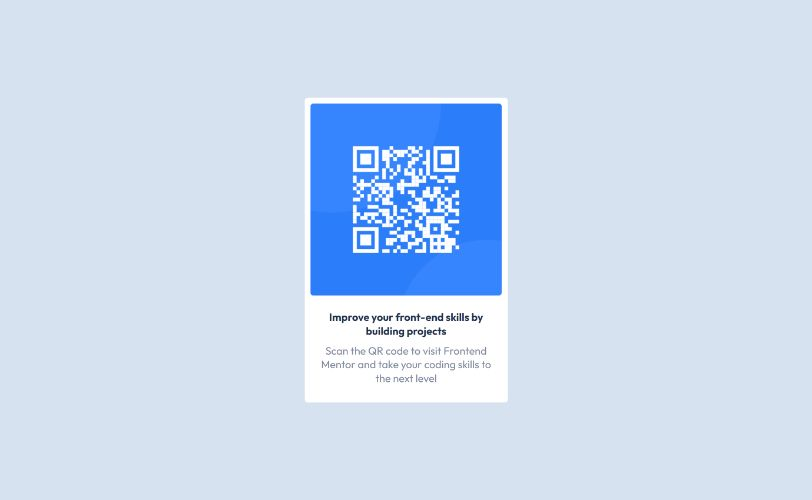

# QR code component solution

Это решение [QR code component challenge on Frontend Mentor](https://www.frontendmentor.io/challenges/qr-code-component-iux_sIO_H).

## Оглавление

- [Скриншот](#скриншоты)
- [Ссылки](#ссылки)
- [Используемые технологии](#технологии)
- [Автор](#автор)

### Скриншоты

### Ссылки

- [Caйт](https://dulcet-florentine-39ad12.netlify.app/)

### Технологии

- Семантическая разметка HTML5  
- CSS

## Автор

- [Профиль GitHub](https://github.com/DanilVystupov)